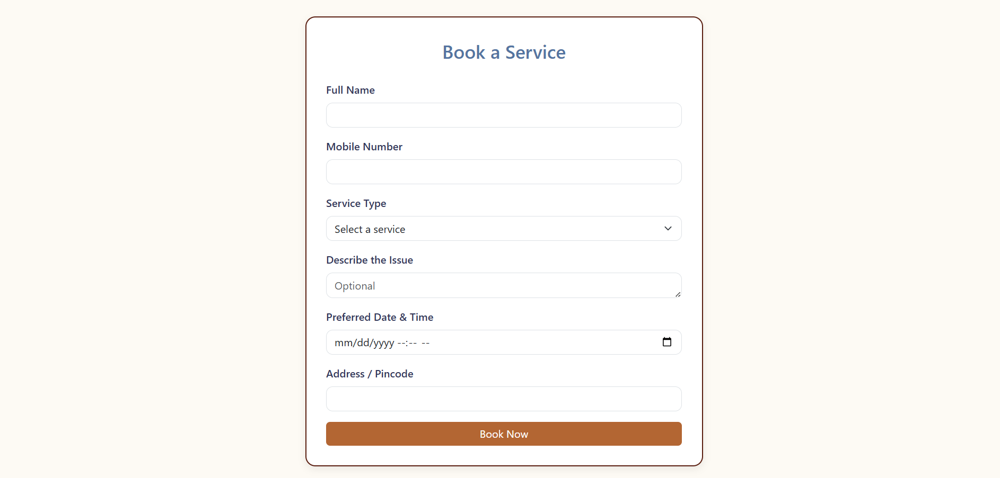
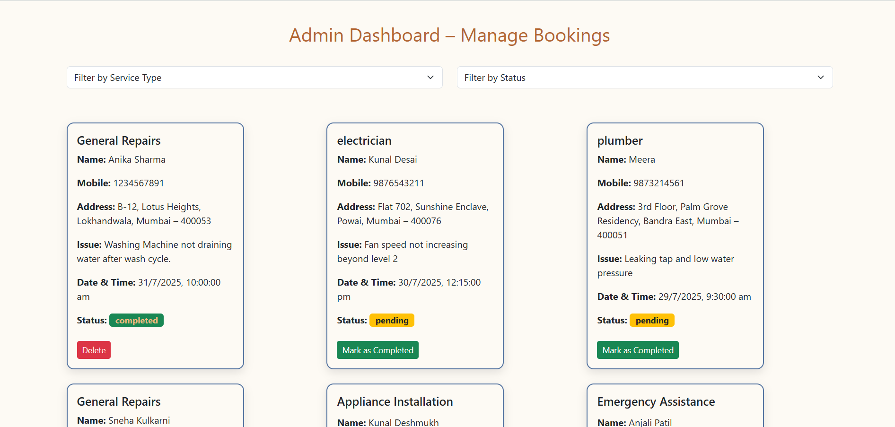

# QuickFix – Service Tracker for Local Technicians

QuickFix is a simple, responsive web application that helps customers book trusted local services like electricians, plumbers, etc and allows service providers to manage and track those bookings efficiently.

---

## Features

### Public Booking Form
- Enter name, mobile number, service type, issue description, preferred date/time, and address.
- Validates inputs (e.g., 10-digit mobile).
- Stores booking data locally in the browser.

### Admin Dashboard
- View all bookings in a card-based layout.
- Filter by **Service Type** or **Booking Status**.
- Mark pending bookings as "Completed" or delete completed ones.
- Shows message when no bookings exist.

### Data Storage
- Uses **localStorage** to persist bookings without backend setup.

### Responsive Design
- Built with **Bootstrap 5** + custom CSS.
- Mobile-friendly UI for both customer and admin views.

---

## 🛠️ Tech Stack

- **HTML5**
- **CSS3**
- **JavaScript (ES6)**
- **Bootstrap 5**

---

# Live Demo

[🔗 View Live]()

---

# Screenshots

### Desktop View

### Mobile View

---
